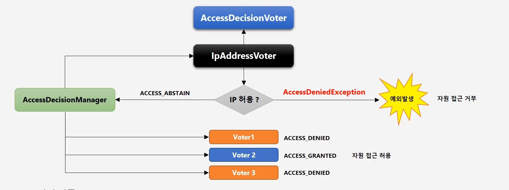

# 6-7) 인가처리 허용 필터 - PermitAllFilter 구현
> 6-5에서 권한검사를 한다면 모두가 접근할 수 있는 자원은 AbstractSecurityInterceptor에 보내지 않도록 할 것이다.  
  


## FilterSecurityInterceptor 상속
> FilterSecurityInterceptor 를 상속 받고 FilterSecurityInterceptor 클래스 내부 로직중 아래 내용만 가지고온다.  
```java
	private static final String FILTER_APPLIED = "__spring_security_filterSecurityInterceptor_filterApplied";
	private boolean observeOncePerRequest = true;

    public void invoke(FilterInvocation filterInvocation) throws IOException, ServletException {
        if (isApplied(filterInvocation) && this.observeOncePerRequest) {
        // filter already applied to this request and user wants us to observe
        // once-per-request handling, so don't re-do security checking
        filterInvocation.getChain().doFilter(filterInvocation.getRequest(), filterInvocation.getResponse());
        return;
        }
        // first time this request being called, so perform security checking
        if (filterInvocation.getRequest() != null && this.observeOncePerRequest) {
        filterInvocation.getRequest().setAttribute(FILTER_APPLIED, Boolean.TRUE);
        }
        InterceptorStatusToken token = beforeInvocation(filterInvocation);
        try {
        filterInvocation.getChain().doFilter(filterInvocation.getRequest(), filterInvocation.getResponse());
        } finally {
        super.finallyInvocation(token);
        }
        super.afterInvocation(token, null);
        }
    
    private boolean isApplied(FilterInvocation filterInvocation) {
        return (filterInvocation.getRequest() != null)
        && (filterInvocation.getRequest().getAttribute(FILTER_APPLIED) != null);
	}
```  

<br>
<br>  

> 생성자를 통해 permitAll 자원을 등록한다. 
> beforeInvocation 메소드를 통해 permitAll 자원과 일치한다면 null를 반환하여 더이상 진행하지 않도록 한다.  
```java
public class PermitAllFilter extends FilterSecurityInterceptor {

	private static final String FILTER_APPLIED = "__spring_security_filterSecurityInterceptor_filterApplied";
	private boolean observeOncePerRequest = true;

	private List<RequestMatcher> permitAllRequestMathchers = new ArrayList<>();

	public PermitAllFilter(String...permitAllResources) {

		for (String permitAllResource : permitAllResources) {
			permitAllRequestMathchers.add(new AntPathRequestMatcher(permitAllResource));
		}
	}

	@Override
	protected InterceptorStatusToken beforeInvocation(Object object) {
		boolean isPermitAll = false;
		HttpServletRequest request = ((FilterInvocation) object).getRequest();
		for (RequestMatcher permitAllRequestMathcher : permitAllRequestMathchers) {
			if (permitAllRequestMathcher.matches(request)){
				isPermitAll = true;
				break;
			}
		}

		if (isPermitAll){
			return null;
		}
		return super.beforeInvocation(object);
	}

	public void invoke(FilterInvocation filterInvocation) throws IOException, ServletException {
      		if (isApplied(filterInvocation) && this.observeOncePerRequest) {
			// filter already applied to this request and user wants us to observe
			// once-per-request handling, so don't re-do security checking
			filterInvocation.getChain().doFilter(filterInvocation.getRequest(), filterInvocation.getResponse());
			return;
		}
		// first time this request being called, so perform security checking
		if (filterInvocation.getRequest() != null && this.observeOncePerRequest) {
			filterInvocation.getRequest().setAttribute(FILTER_APPLIED, Boolean.TRUE);
		}
		InterceptorStatusToken token = beforeInvocation(filterInvocation);
		try {
			filterInvocation.getChain().doFilter(filterInvocation.getRequest(), filterInvocation.getResponse());
		} finally {
			super.finallyInvocation(token);
		}
		super.afterInvocation(token, null);
	}

	private boolean isApplied(FilterInvocation filterInvocation) {
		return (filterInvocation.getRequest() != null)
			&& (filterInvocation.getRequest().getAttribute(FILTER_APPLIED) != null);
	}
}
```


<br>
<br>
<br>

## SecurityConfig 로직 수정
> customFilterSecurityInterceptor 메소드를 이제 PermitAllFilter 를 생성하는 로직으로 수정한다.  

- 기존로직  
```java
	@Bean
	public FilterSecurityInterceptor customFilterSecurityInterceptor() throws Exception {
		FilterSecurityInterceptor filterSecurityInterceptor = new FilterSecurityInterceptor();
		filterSecurityInterceptor.setSecurityMetadataSource(urlFilterInvocationSecurityMetadatasource());
		filterSecurityInterceptor.setAccessDecisionManager(affirmativeBased());
		filterSecurityInterceptor.setAuthenticationManager(authenticationManagerBean());
		return filterSecurityInterceptor;
	}
 
```  

<br>
<br>  


- 변경된 로직  
```java
	@Bean
	public PermitAllFilter customFilterSecurityInterceptor() throws Exception {
		PermitAllFilter permitAllFilter = new PermitAllFilter(permitAllResources);
		permitAllFilter.setSecurityMetadataSource(urlFilterInvocationSecurityMetadatasource());
		permitAllFilter.setAccessDecisionManager(affirmativeBased());
		permitAllFilter.setAuthenticationManager(authenticationManagerBean());
		return permitAllFilter;
	}
```