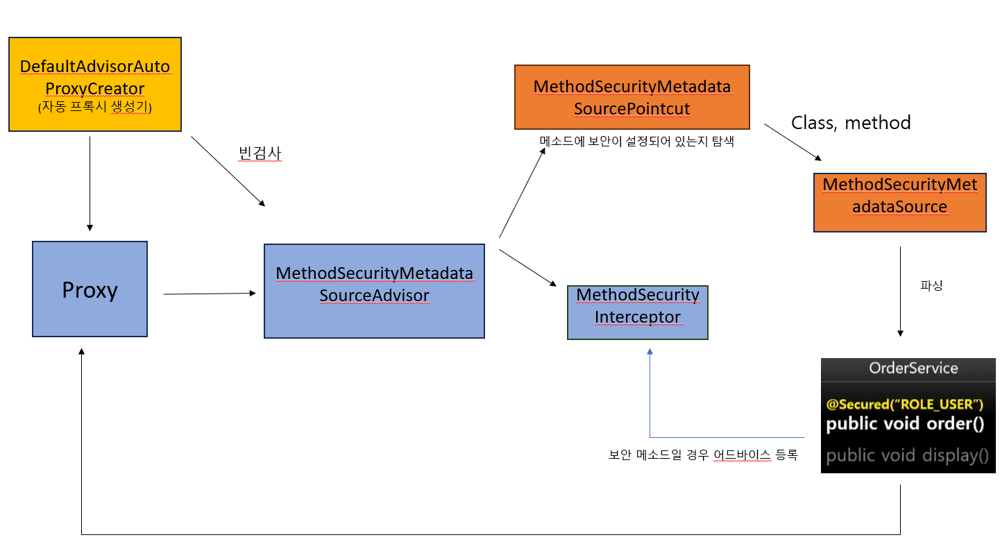
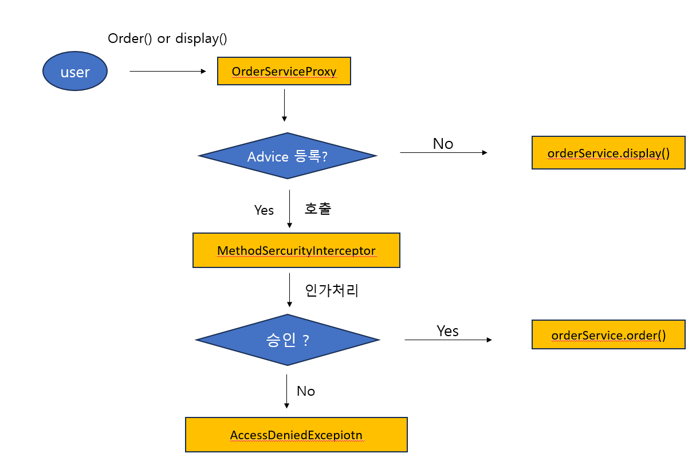

# 7-3) AOP Method 기반 DB 연동 - 주요 아키텍처 이해

## 인가 처리를 위한 초기화 과정과 진행
- 초기화 과정  
1 초기화 시 전체 빈을 검사하면서 보안이 설정된 메소드가 있는지 탐색  
2 빈의 프록시 객체를 생성  
3 보안 메소드에 인가처리(권한심사) 기능을 하는 Advice 를 등록  
4 빈 참조시 실제 빈이 아닌 프록시 빈 객체를 참조  




<br>
<br>
<br>


- 진행과정  
1 메소드 호출 시 프록시 객체를 통해 메소드를 호출  
2 Advice가 등록되어 있다면 Advice를 작동하게 하여 인가 처리  
3 권한 심사 통과하면 실제 빈의 메소드를 호출한다   





## 사용법
- 기존 ` myPage()` 메소드에  `userService.order();`  메소드를 추가한다.
```java
	@GetMapping(value = "/mypage")
	public String myPage() throws Exception {

		userService.order();
		
		return "/user/mypage";
	}
```


- `order()` 메소드에는 `@Secured("ROLE_MANAGER")`를 추가해 myPage에는 ROLE_USER 는 접근할 수 있지만 order()메소드에 접근은 못하는걸 확인할 수 있다.
```java
    @Secured("ROLE_MANAGER")
	public void order() {
        System.out.println("order");
    }
```
