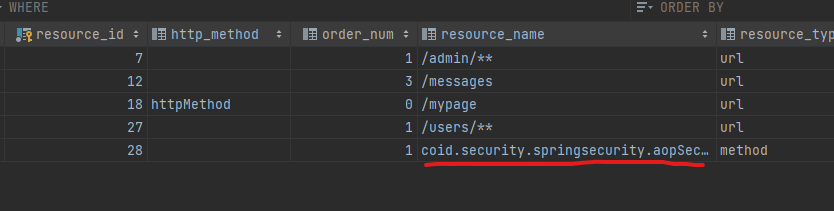

# 7-6) AOP Method 기반 DB 연동 - MapBasedSecurityMetadataSource (3)

## FactoryBean<LinkedHashMap<String, List<ConfigAttribute>>> 구현 클래스 생성
```java
public class MethodResourceFactoryBean implements FactoryBean<LinkedHashMap<String, List<ConfigAttribute>>> {

	private SecurityResourceService securityResourceService;
	private LinkedHashMap<String, List<ConfigAttribute>> resourceMap;

	public void setSecurityResourceService(SecurityResourceService securityResourceService) {
		this.securityResourceService = securityResourceService;
	}

	@Override
	public LinkedHashMap<String, List<ConfigAttribute>> getObject() {
		if (resourceMap == null) {
			init();
		}
		return resourceMap;
	}

	private void init() {
		resourceMap = securityResourceService.getMethodResourceList();
	}

	@Override
	public Class<?> getObjectType() {
		return LinkedHashMap.class;
	}

	@Override
	public boolean isSingleton() {
		return FactoryBean.super.isSingleton();
	}
}
```

## SecurityResourceService 클래스에서 getMethodResourceList() 메소드 생성
```java
    public LinkedHashMap<String, List<ConfigAttribute>> getMethodResourceList() {
        LinkedHashMap<String, List<ConfigAttribute>> result = new LinkedHashMap<>();

        List<Resources> resourcesList = resourcesRepository.findAllMethodResources();
        resourcesList.forEach(x -> {
            List<ConfigAttribute> configAttributeList = new ArrayList<>();
            x.getRoleSet().forEach(role -> configAttributeList.add(new SecurityConfig(role.getRoleName())));
            result.put(x.getResourceName(), configAttributeList);
        });

        return result;
    }
```


## ResourcesRepository.findAllMethodResources() 메소드 생성
```java
    @Query("select r from Resources r join fetch r.roleSet where r.resourceType = 'method' order by r.orderNum desc")
    List<Resources> findAllMethodResources();
```

## SetupDataLoader.setupSecurityResources() 메소드 수정  
- 런타임시 해당 데이터가 MethodSecurityInterceptor가 인가처리 어드바이스로 등록한다.




```java
	public void setupSecurityResources() {
		setupAccessIpData();

		Set<Role> roles = new HashSet<>();
		Role adminRole = createRoleIfNotFound("ROLE_ADMIN", "관리자");
		roles.add(adminRole);
		createResourceIfNotFound("/admin/**", "", roles, "url");
		Account account = createUserIfNotFound("admin", "pass", "admin@gmail.com", 10, roles);

		Set<Role> roles1 = new HashSet<>();


		Role managerRole = createRoleIfNotFound("ROLE_MANAGER", "매니저");
		roles1.add(managerRole);

		Set<Role> roles3 = new HashSet<>();

		Role childRole1 = createRoleIfNotFound("ROLE_USER", "회원");
		roles3.add(childRole1);
		createResourceIfNotFound("/users/**", "", roles3, "url");
		createUserIfNotFound("user", "pass", "user@gmail.com", 30, roles3);
		createRoleHierarchyIfNotFound(childRole1, managerRole);
		createRoleHierarchyIfNotFound(managerRole, adminRole);

		createResourceIfNotFound("coid.security.springsecurity.aopSecurity.AopMethodService.methodSecured", "", roles3, "method");   // 추가된 내용  
		// createResourceIfNotFound("coid.security.springsecurity.aopsecurity.method.AopMethodService.innerCallMethodTest", "", roles1, "method");
		// createResourceIfNotFound("execution(* coid.security.springsecurity.aopsecurity.pointcut.*Service.*(..))", "", roles1, "pointcut");
		// createUserIfNotFound("manager", "pass", "manager@gmail.com", 20, roles1);
		
	}
```

## MethodSecurityConfig 클래스 로직추가 
```java
@Configuration
@RequiredArgsConstructor
@EnableGlobalMethodSecurity(prePostEnabled = true, securedEnabled = true)
public class MethodSecurityConfig extends GlobalMethodSecurityConfiguration {

	private final SecurityResourceService securityResourceService;


	@Override
	protected MethodSecurityMetadataSource customMethodSecurityMetadataSource() {
		return mapBasedMethodSecurityMetadataSource();
	}

	@Bean
	public MapBasedMethodSecurityMetadataSource mapBasedMethodSecurityMetadataSource() {
		return new MapBasedMethodSecurityMetadataSource(methodResourcesMapFactoryBean().getObject());
	}

	@Bean
	public MethodResourceFactoryBean methodResourcesMapFactoryBean() {
		MethodResourceFactoryBean methodResourceFactoryBean = new MethodResourceFactoryBean();
		methodResourceFactoryBean.setSecurityResourceService(securityResourceService);
		return methodResourceFactoryBean;
	}
}
```

## AopMethodService 생성
```java
@Service
public class AopMethodService {

	public void methodSecured() {
		System.out.println("methodSecured");
	}

}
```


## AopSecurityController 클래스에 로직추가
```java
	@GetMapping("/methodSecured")
	public String methodSecured(Model model) {
		aopMethodService.methodSecured();
		model.addAttribute("method", "Success MethodSecured");
		return "aop/method";
	}
```

## method.html 와 home.html 에 로직추가
- method.html
```java
 <a th:href="@{/methodSecured}" style="" class="nav-link text-primary">메소드보안</a>
```

- home.html
```java
<a th:href="@{/methodSecured}"style=""class="nav-link text-primary">메소드보안</a>
```


